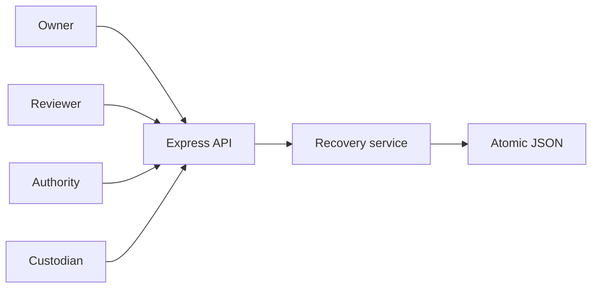
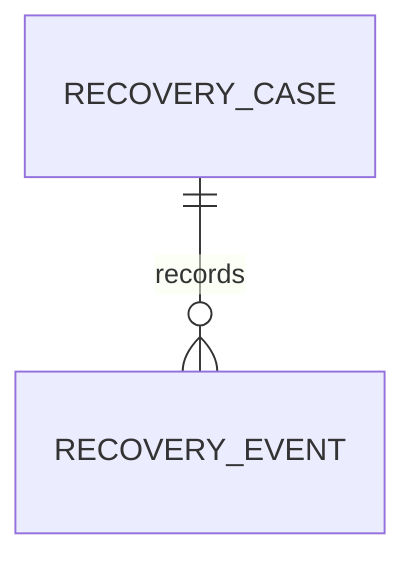
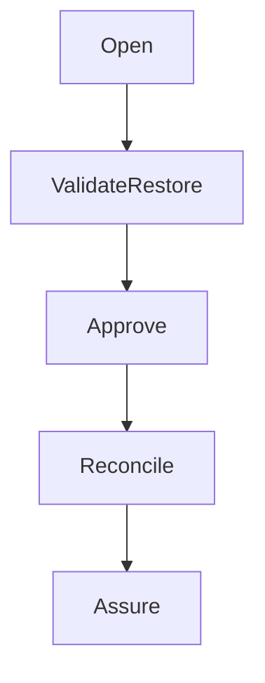
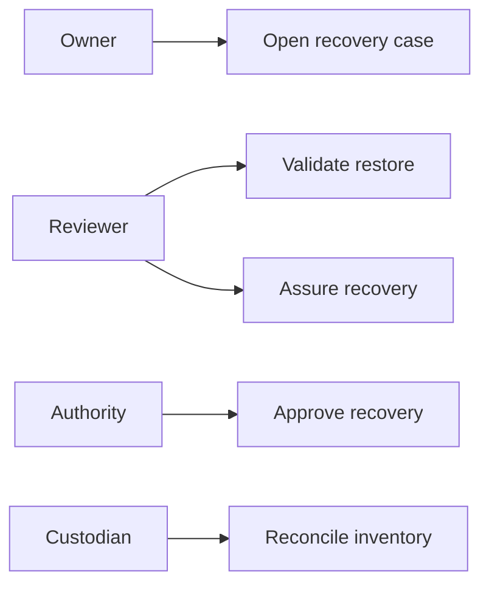
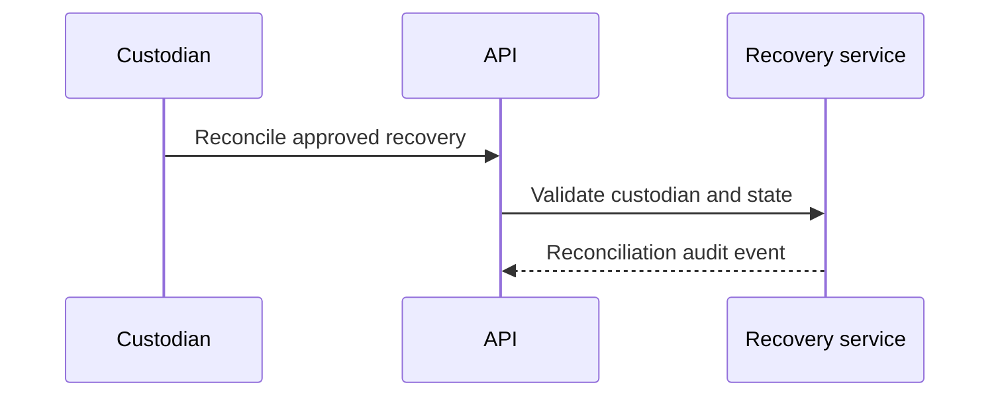

# Supplier Evidence Access Recovery Assurance Platform
## The Problem
Evidence recovery requires more than restoring a file. Governance teams need proof that the restored evidence was independently validated, recovery was approved, the custodian reconciled the inventory, and assurance was performed before the evidence became dependable again.
## The Solution
This service governs evidence recovery from intake through assurance. The owner opens a recovery case, a reviewer validates restoration, an authority approves, the custodian reconciles evidence inventory, and the reviewer assures the completed case.
## Live Demo and Tech Stack
Run `http://localhost:60700/health`. The stack uses Node.js 22, Express 5, atomic JSON persistence, Vitest, and GitHub Actions. The service binds to `0.0.0.0` for LAN operation.
## Local Setup and Run Instructions
```bash
npm install
npm test
env -u PORT node server.mjs
```
## System Documentation
### System Architecture Diagram

### Entity Relationship Diagram

### Data Flow Diagram

### Use Case Diagram

### Sequence Diagram

## Owner

Created and maintained by Kholipha Ahmmad Al-Amin.

Software Engineer and AI Specialist

Founder and CEO of EquiSaaS BD

Principal Consultant at AR IT Consultancy

Full Stack Developer and SaaS Product Builder

### Official links

Portfolio: https://kholipha-ahmmad-al-amin.equisaas-bd.com/

GitHub: https://github.com/kholipha-ahmmad-al-amin

LinkedIn: https://www.linkedin.com/in/kholipha-ahmmad-al-amin

X: https://x.com/al_amin5519

Facebook: https://www.facebook.com/kholipha.ahmmad.al.amin

Instagram: https://www.instagram.com/kholipha.ahmmad.al.amin

## Ownership

This project was created and is maintained by Kholipha Ahmmad Al-Amin.

